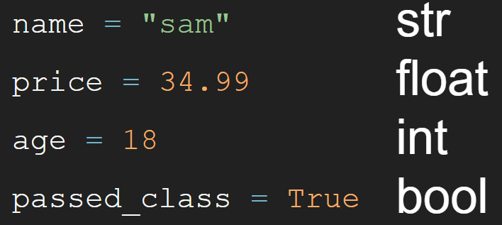
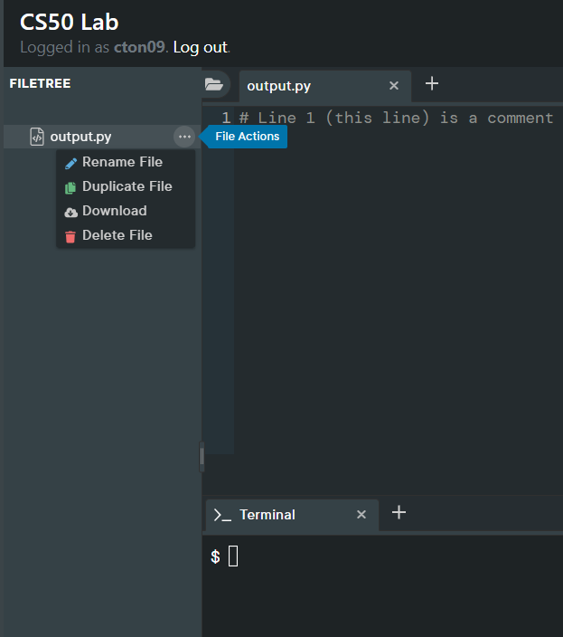

# Input/Output Assignment

## Part 1 - Output

The function <Code>print()</Code> will output to the terminal (also called the console).

Whatever is inside the parenthesis will be printed to the screen.

* **Remember to use quotation marks**

Example:

    print("Hello and welcome to Eclipse")

Write a program which prints out your address to the terminal when run.

### To run the file output.py, go to the terminal and use the following command: 
> $ python output.py



## Part 2 - Variables

Variables store data. To assign a value to a variable use the format

    name = "Ryan"

The variable will then be stored in the computer for the rest of the program.

We can print out the value of a variable using <code>print()</code>

    print(name)

The print function can also print out multiple items if they are separated by commas.

    print("My name is", name)

### To try it out:
1. add the lines of code to the file output.py
2. use the same command as in Part 1:
> $ python output.py



## Variable Types





## Part 3 - On your own

Write a program to do the following:

1. Create variables of the proper types for the following **made up** woodberry student

 - His first and last name
 - His age in years
 - The form he is in
 - His dorm
 - His current GPA (should be between 0-4)

2. When the program is run, a student profile (match the formatting exactly) should be printed out like the one below:

```
**************************
* Tom Barnaby - 16
* 4th form - Walker B
* Current GPA: 3.41
**************************
```

3. When you are finished, you should download the file as seen below and upload it to canvas under the assignment.

